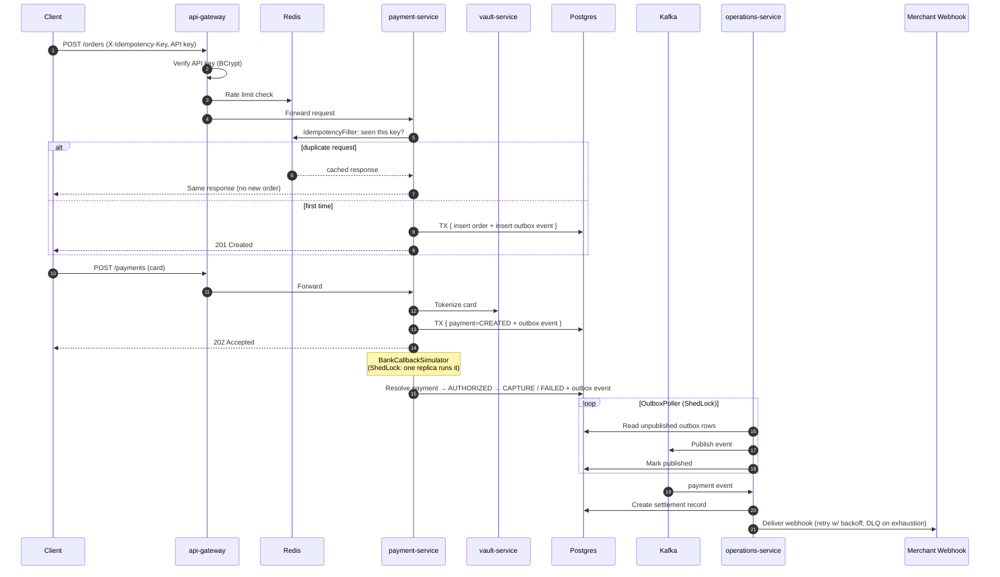
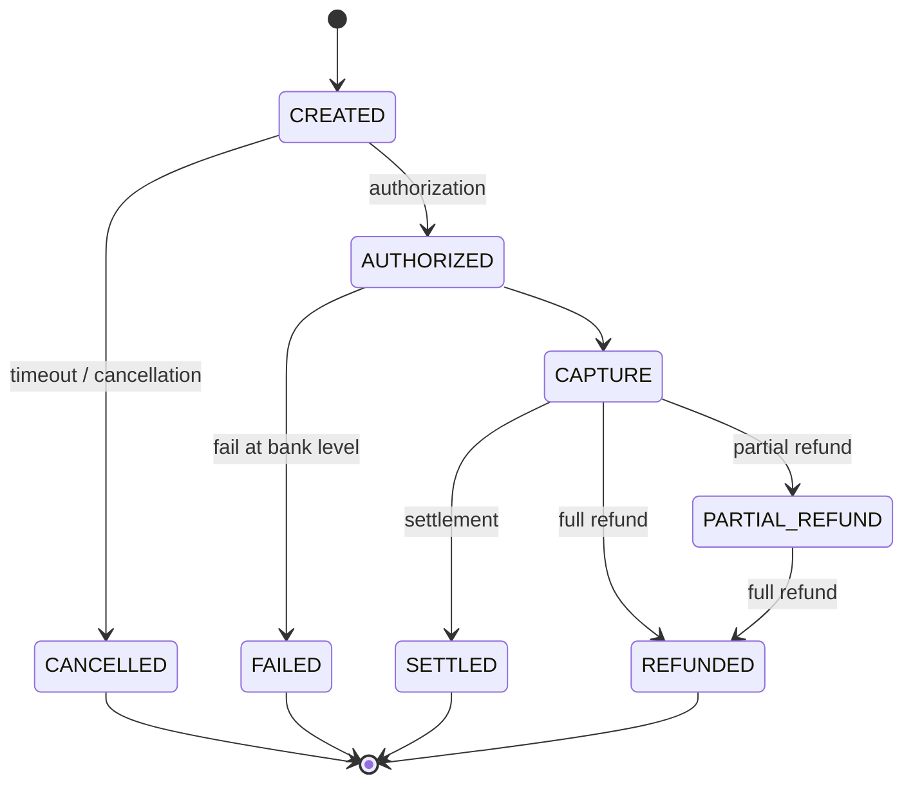
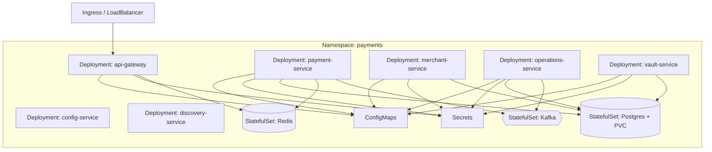
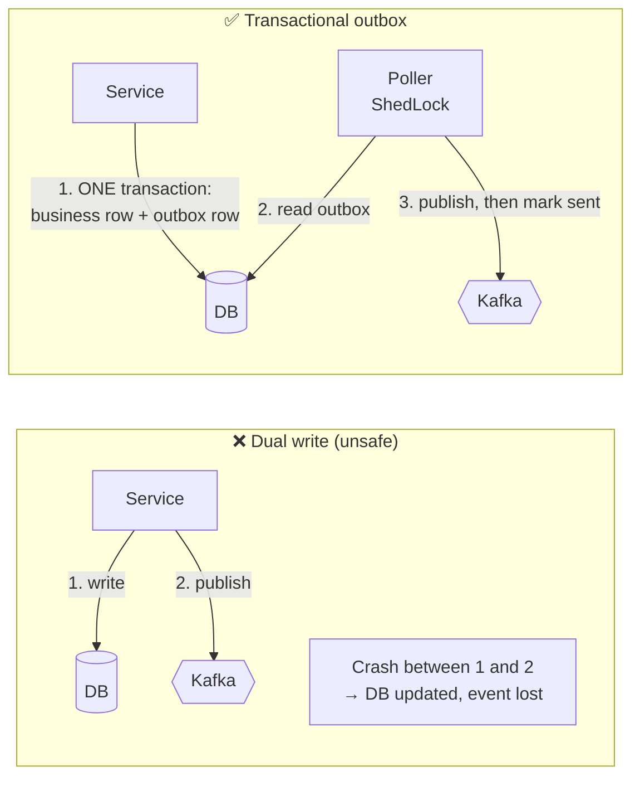
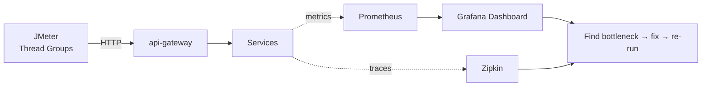

<div align="center">

# 💳 Razorpay Clone — Distributed Payment Platform

**A Kubernetes-native, event-driven payment gateway built with Spring Boot microservices.**
Order creation · Payment authorization · Bank callback simulation · Settlement · Webhooks


</div>

---

## 📑 Table of Contents

1. [Project Overview](#-project-overview)
2. [Project Architecture Overview](#-project-architecture-overview)
3. [Payment Methods Flow](#-payment-methods-flow)
4. [Data Model (ER Diagram)](#-data-model-er-diagram)
5. [Design Patterns Involved](#-design-patterns-involved)
6. [Optimisations and Bug Fixes](#-optimisations-and-bug-fixes)
7. [Load Testing with JMeter](#-load-testing-with-jmeter)
8. [Deploying on Kubernetes](#-deploying-on-kubernetes)
9. [Getting Started (Local)](#-getting-started-local)

---

## 🚀 Project Overview

A distributed payment platform modelled on how **Stripe, Razorpay and Adyen** structure their systems in production. It covers the full lifecycle:

```
Order → Payment → Async Bank Resolution → Settlement → Webhook Delivery
```

Built with **Java 25** and **Spring Boot 4.1.1** across **7 microservices**, backed by **per-service Postgres databases, Redis, and Kafka**, with a full **observability stack**, and running as a real Kubernetes deployment (`Deployment`, `StatefulSet`, `Service`, `ConfigMap`, `Secret`).

### What actually got built

- ✅ **A correct, idempotent, distributed payment flow** using the consistency patterns production fintech systems depend on: transactional outbox, distributed locking, idempotency keys.
- ✅ **A real Kubernetes deployment**: 7 services + 3 stateful data stores as actual manifests, applied, restarted, scaled and debugged against a live cluster with the standard `kubectl` workflow.
- ✅ **A fully wired observability stack**: Prometheus scraping every service, a custom Grafana dashboard, Zipkin distributed tracing, used live to find and confirm every bottleneck documented here.

---

## 🏗 Project Architecture Overview

### Services

| Service | Responsibility |
|---|---|
| `api-gateway` | Auth (API key + BCrypt), rate limiting, routing |
| `payment-service` | Orders, payments, state machine, bank callback simulation |
| `merchant-service` | Merchant accounts, API keys, customers, webhooks |
| `operations-service` | Settlements, webhook delivery, outbox relay |
| `vault-service` | Card tokenization, encryption |
| `config-service` | Centralized config (Spring Cloud Config, git-backed) |
| `discovery-service` | Service registry |

### High-level system design


Clients reach the platform through the **API Gateway**: the checkout SDK and analytics dashboard use JWT, while merchant backends use server-to-server **API key** auth. Business services (`merchant`, `payment`, `operations`, `vault`) sit behind the gateway in a private subnet, share Redis for cache and counters, exchange events over Kafka via the outbox, and each own their own database (`merchant-db`, `payment-db`, `operations-db`, `vault-db`).

### Payment lifecycle (sequence)



### Payment object lifecycle (state machine)



Every transition is recorded in `PAYMENT_TRANSITION_LOG` (from/to status, event type, actor, reason), so the full history of a payment can be audited.

### Kubernetes topology



---

## 💸 Payment Methods Flow

End-to-end sequence diagrams for the four supported payment methods: **Card**, **UPI**, **Net Banking** and **Wallet**.


| Method | How it works | Notable detail |
|---|---|---|
| **Card** | Card details go to `vault-service`, which encrypts the PAN and returns a token. The processor swaps the token for the real PAN to authorize via acquirer, card network and issuer. | Funds are held on authorization, then settled in a T+1 batch. Net = amount − transfer fee − scheme fee − PG fees. |
| **UPI** | Intent (mobile app-to-app) or Collect (VPA entered at checkout) via the NPCI UPI switch. | Near-instant settlement at the rail; the payment goes AUTHORIZED then CAPTURED. |
| **Net Banking** | Gateway builds a signed redirect URL, the customer authenticates on the issuing bank's site, and the bank sends a signed webhook back. | Gateway verifies the signature and status before moving to CAPTURED. |
| **Wallet** | Direct API call to the wallet provider with an OTP step. | Closed-loop: the wallet provider is its own issuer, so debit and commit are instant. Insufficient balance returns an error. |

In every flow, the merchant is notified by an **HMAC-signed `payment.captured` webhook**, and money moves to the merchant account asynchronously (T+1) through the settlement scheduler, ending in `SETTLED`.

---

## 🗄 Data Model (ER Diagram)


Each service owns its own database. The logical grouping of tables is:

| Database | Tables |
|---|---|
| `merchant-db` | `MERCHANT`, `API_KEY`, `APP_USER`, `MERCHANT_WEBHOOK_CONFIG`, `CUSTOMER` |
| `payment-db` | `ORDER_RECORD`, `PAYMENT`, `REFUND`, `PAYMENT_TRANSITION_LOG` |
| `vault-db` | `VAULT_CARD`, `CARD_TOKEN` |
| `operations-db` | `WEBHOOK_EVENT`, `DLQ_EVENT`, `SETTLEMENT`, `SETTLEMENT_PAYMENT` |

Design notes:

- **Money is stored as `long` in paise** (`amount_paise`), never as floating point.
- `idempotency_key` columns on `ORDER_RECORD` and `PAYMENT` back the idempotency guarantee at the database level.
- `VAULT_CARD` stores only the **encrypted PAN and encrypted DEK**, plus `last_four`, `brand`, `bin` and expiry; the raw PAN is never persisted.
- `WEBHOOK_EVENT` tracks attempts, `next_retry_at` and response codes, and exhausted events move to `DLQ_EVENT` for replay.
- `SETTLEMENT` breaks each payout into gross, refund, fee, GST and net amounts.

---

## 🧩 Design Patterns Involved

| Pattern | Where | What breaks without it, at scale |
|---|---|---|
| **Idempotency keys** | `X-Idempotency-Key` header, Redis-backed `IdempotencyFilter` | Retries are constant at scale (timeouts, LB failover, network blips). Without this, retries create duplicate orders/charges. |
| **Distributed scheduler locking** | **ShedLock** on `OutboxPoller`, `BankCallbackSimulator` | The moment you run >1 replica of any `@Scheduled` job, every replica double-processes the same work. |
| **Transactional outbox** | Outbox table + poller, atomic with the business write | "Write to DB" and "publish to Kafka" can't both be guaranteed under partial failure. A real distributed-systems bug, not an edge case. |
| **Stateless services** | Every service: DB/Redis hold all state, not memory | The precondition for horizontal scaling. If two consecutive requests need the same pod, you can't add replicas. |
| **Rate limiting** | Redis-backed, per API key (token bucket / sliding window / fixed window all implemented) | One misbehaving client takes everyone down. |
| **Circuit breaker + retry** | Resilience4j around the `merchant-service` Feign call | More scale = more failure surface. Stops one slow dependency cascading into a full outage. |
| **Full observability** | Prometheus + Grafana (per-service CPU/memory), Zipkin tracing | You can't capacity-plan or debug a system you can't see into. |

### Why the outbox pattern matters



Delivery is **at-least-once**, so consumers are idempotent as well.

---

## 🔧 Optimisations and Bug Fixes

Every item below was found using the observability stack (Grafana dashboards + Zipkin traces) and confirmed under load.

| # | Problem observed | Root cause | Fix |
|---|---|---|---|
| 1 | Duplicate orders/charges on client retry | No dedup on retried requests | Redis-backed `IdempotencyFilter` keyed on `X-Idempotency-Key`, with a DB-level `idempotency_key` column as a backstop |
| 2 | Same outbox rows / settlements processed twice after scaling to >1 replica | `@Scheduled` jobs ran on every pod | **ShedLock** on `OutboxPoller` and `BankCallbackSimulator` so only one replica executes at a time |
| 3 | Events lost when the Kafka publish failed after the DB commit | Dual write | Transactional outbox + poller: the business row and event are committed atomically |
| 4 | One slow dependency stalled request threads | Unbounded Feign calls to `merchant-service` | Resilience4j circuit breaker + retry + timeouts to contain failures and fail fast |

---

## 📈 Load Testing with JMeter

Load tests were run with **Apache JMeter**, with Prometheus/Grafana and Zipkin watched live to locate bottlenecks, fix them, and re-run.



### Test run

| Item | Value |
|---|---|
| Tool | Apache JMeter (HTML dashboard report) |
| Results file | `results.jtl` |
| Start time | 9/12/26, 11:13 PM |
| End time | 9/12/26, 11:15 PM |

### Full report

The complete JMeter dashboard (APDEX, request summary, statistics, errors, and over-time, throughput and response-time charts) is in [`docs/load-test/`](docs/load-test/index.html). Open it from the generated report folder (the one that contains `content/` and `sbadmin2-1.0.7/`) in a browser to see the charts.

### Running

```bash
# Headless run
jmeter -n -t jmeter/payment-flow.jmx \
       -Jhost=<GATEWAY_HOST> -Jthreads=200 -Jrampup=60 -Jduration=600 \
       -l results.jtl -e -o report

# Open report/index.html
```

---

## ☸️ Deploying on Kubernetes

The services and data stores run as standard Kubernetes manifests, so the same workflow works on any cluster (local, EKS, GKE, AKS).

### Deploy

```bash
# 1. Namespace, config and secrets
kubectl apply -f k8s/namespace.yaml
kubectl apply -f k8s/config/ -f k8s/secrets/

# 2. Data stores first, then platform services, then apps
kubectl apply -f k8s/data/        # postgres, redis, kafka
kubectl apply -f k8s/platform/    # config-service, discovery-service
kubectl apply -f k8s/apps/        # gateway, payment, merchant, operations, vault
kubectl apply -f k8s/observability/

# 3. Scale and verify
kubectl -n payments scale deploy/payment-service --replicas=4
kubectl -n payments get pods -w
```

### Autoscaling

```bash
kubectl -n payments autoscale deploy api-gateway     --cpu-percent=60 --min=2 --max=10
kubectl -n payments autoscale deploy payment-service --cpu-percent=60 --min=2 --max=10
```

---

## ⚙️ Getting Started (Local)

### Prerequisites

Java 25, Maven, Docker, `kubectl`, and a local cluster (Minikube / kind / Docker Desktop).

```bash
git clone https://github.com/KamaliyaVishal/spring-boot-microservice-razorpay-clone.git
cd spring-boot-microservice-razorpay-clone

# Build all services
mvn clean package -DskipTests

# Build images (adjust to your Dockerfile / Jib setup)
docker build -t <registry>/payment-service ./payment-service
# ...repeat per service

# Deploy
kubectl apply -f k8s/
kubectl get pods -n payments
```

### Example call

```bash
curl -X POST http://<GATEWAY>/api/v1/payments/orders \
  -H "Authorization: Bearer <API_KEY>" \
  -H "X-Idempotency-Key: $(uuidgen)" \
  -H "Content-Type: application/json" \
  -d '{"amount": 49900, "currency": "INR", "receipt": "rcpt_001"}'
```

### Observability

| Tool | Purpose |
|---|---|
| Grafana | Per-service CPU/memory, latency, throughput |
| Prometheus | Raw metrics and queries |
| Zipkin | Distributed traces |

---

<div align="center">

**Built to learn how real payment systems stay correct at scale.** ⭐ Star the repo if it helped you!

</div>
