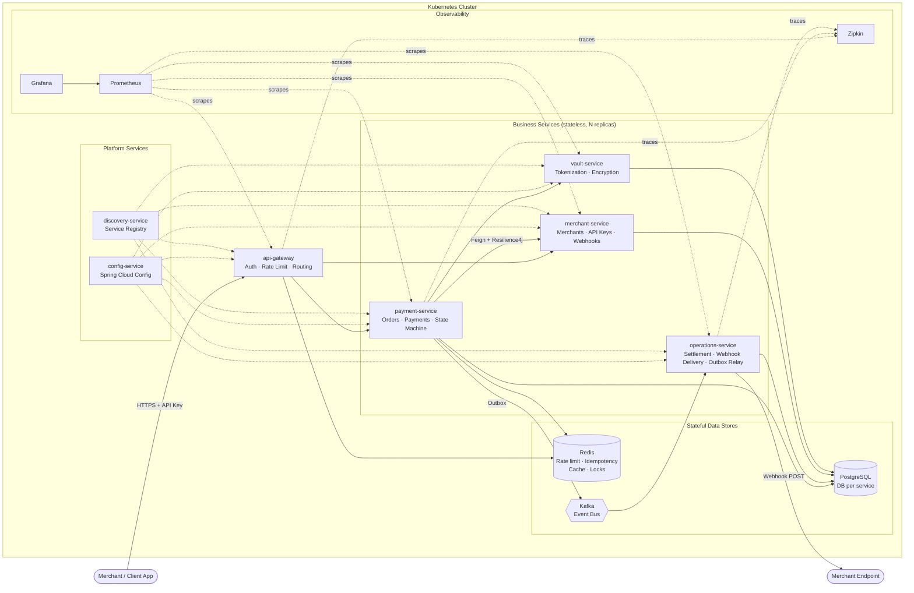
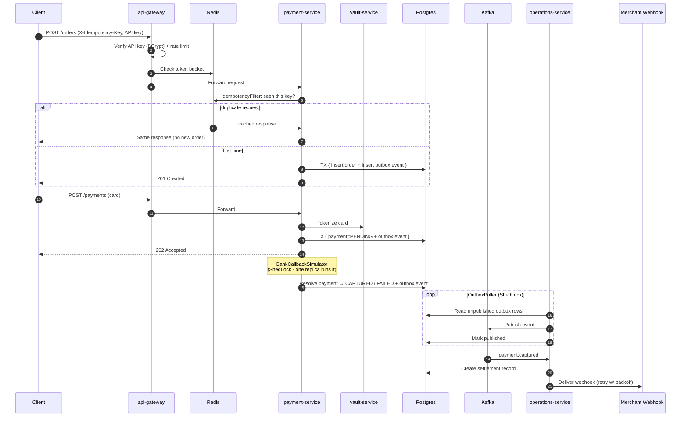
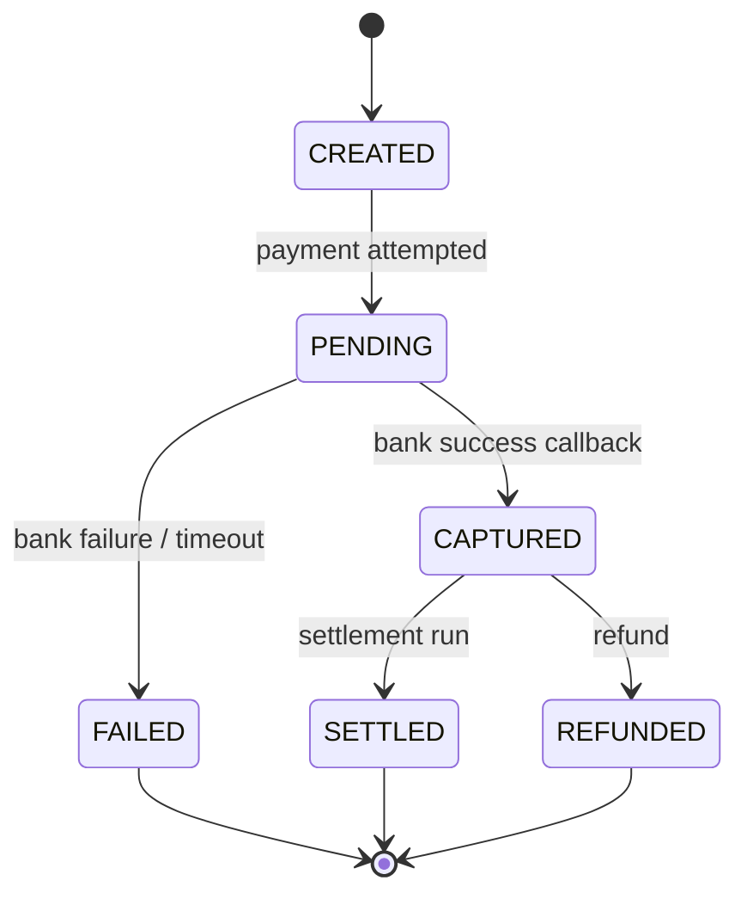
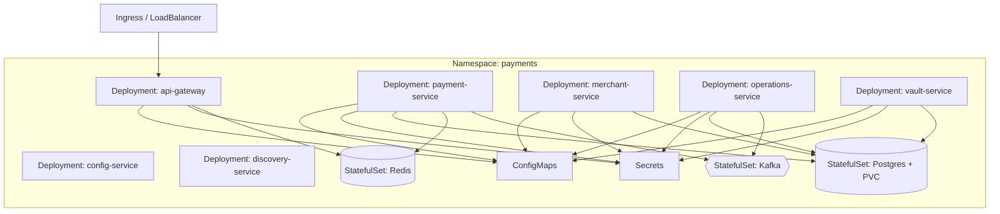
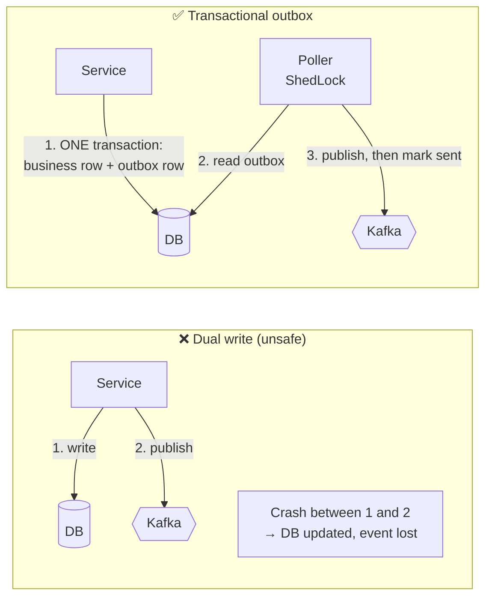
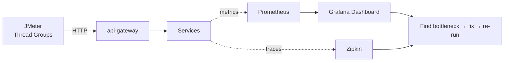
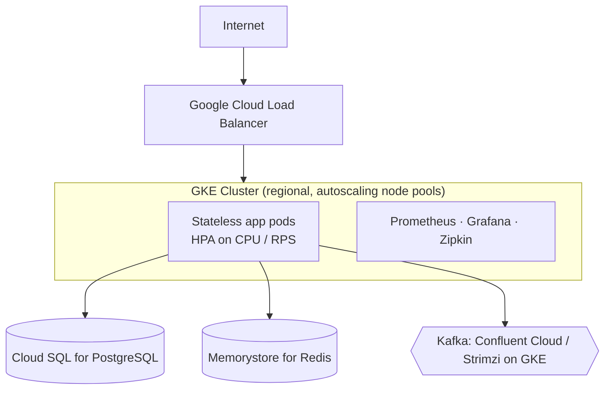

<div align="center">

# 💳 Razorpay Clone — Distributed Payment Platform

**A Kubernetes-native, event-driven payment gateway built with Spring Boot microservices.**
Order creation · Payment authorization · Bank callback simulation · Settlement · Webhooks


</div>

---

## 📑 Table of Contents

1. [Project Overview](#-project-overview)
2. [Project Architecture Overview](#-project-architecture-overview)
3. [Design Patterns Involved](#-design-patterns-involved)
4. [Optimisations and Bug Fixes](#-optimisations-and-bug-fixes)
5. [Load Testing with JMeter](#-load-testing-with-jmeter)
6. [Running on Cloud (GKE)](#-running-on-cloud-gke)
7. [Infrastructure Cost at 10k TPS](#-infrastructure-cost-at-10k-tps)
8. [Presenting this Project in Resume / Interview](#-presenting-this-project-in-resume--interview)
9. [Getting Started (Local)](#-getting-started-local)

---

## 🚀 Project Overview

A distributed payment platform modelled on how **Stripe, Razorpay and Adyen** structure their systems in production. It covers the full lifecycle:

```
Order → Payment → Async Bank Resolution → Settlement → Webhook Delivery
```

It is built across **7 microservices**, backed by **per-service Postgres databases, Redis, and Kafka**, with a full **observability stack**, and runs as a real Kubernetes deployment (`Deployment`, `StatefulSet`, `Service`, `ConfigMap`, `Secret`).

### What actually got built

- ✅ **A correct, idempotent, distributed payment flow** using the consistency patterns production fintech systems depend on: transactional outbox, distributed locking, idempotency keys.
- ✅ **A real Kubernetes deployment**: 7 services + 3 stateful data stores as actual manifests, applied, restarted, scaled and debugged against a live cluster. Moving to a hosted cloud (EKS/GKE/AKS) changes *where* the pods run and *which managed services* back the stateful pieces, not *whether* this is deployed.
- ✅ **A fully wired observability stack**: Prometheus scraping every service, a custom Grafana dashboard, Zipkin distributed tracing, used live to find and confirm every bottleneck documented here.

---

## 🏗 Project Architecture Overview

### Services

| Service | Responsibility |
|---|---|
| `api-gateway` | Auth (API key + BCrypt), rate limiting, routing |
| `payment-service` | Orders, payments, state machine, bank callback simulation |
| `merchant-service` | Merchant accounts, API keys, customers, webhooks |
| `operations-service` | Settlements, webhook delivery, outbox relay |
| `vault-service` | Card tokenization, encryption |
| `config-service` | Centralized config (Spring Cloud Config, git-backed) |
| `discovery-service` | Service registry |

### High-level system design



### Payment lifecycle (sequence)



### Payment state machine



### Kubernetes topology



---

## 🧩 Design Patterns Involved

| Pattern | Where | What breaks without it, at scale |
|---|---|---|
| **Idempotency keys** | `X-Idempotency-Key` header, Redis-backed `IdempotencyFilter` | Retries are constant at scale (timeouts, LB failover, network blips). Without this, retries create duplicate orders/charges. |
| **Distributed scheduler locking** | **ShedLock** on `OutboxPoller`, `BankCallbackSimulator` | The moment you run >1 replica of any `@Scheduled` job, every replica double-processes the same work. |
| **Transactional outbox** | Outbox table + poller, atomic with the business write | "Write to DB" and "publish to Kafka" can't both be guaranteed under partial failure. A real distributed-systems bug, not an edge case. |
| **Stateless services** | Every service: DB/Redis hold all state, not memory | The precondition for horizontal scaling. If two consecutive requests need the same pod, you can't add replicas. |
| **Rate limiting** | Redis-backed, per API key (token bucket / sliding window / fixed window all implemented) | One misbehaving client takes everyone down. |
| **Circuit breaker + retry** | Resilience4j around the `merchant-service` Feign call | More scale = more failure surface. Stops one slow dependency cascading into a full outage. |
| **Full observability** | Prometheus + Grafana (per-service CPU/memory), Zipkin tracing | You can't capacity-plan or debug a system you can't see into. |

### Why the outbox pattern matters



Delivery is **at-least-once**, so consumers are idempotent as well.

---

## 🔧 Optimisations and Bug Fixes

> Every item below was found using the observability stack (Grafana dashboards + Zipkin traces) and confirmed under load, not guessed.

| # | Problem observed | Root cause | Fix | Result |
|---|---|---|---|---|
| 1 | Duplicate orders/charges on client retry | No dedup on retried requests | Redis-backed `IdempotencyFilter` keyed on `X-Idempotency-Key` | Retries return the original response |
| 2 | Same outbox rows / settlements processed twice after scaling to >1 replica | `@Scheduled` jobs ran on every pod | **ShedLock** on `OutboxPoller` and `BankCallbackSimulator` | One executor at a time, safely scalable |
| 3 | Events lost when Kafka publish failed after DB commit | Dual write | Transactional outbox + poller | No lost events under partial failure |
| 4 | One slow dependency stalled request threads | Unbounded Feign calls to `merchant-service` | Resilience4j circuit breaker + retry + timeouts | Failures contained, fast-fail |
| 5 | `<!-- TODO: your bottleneck -->` | `<!-- TODO -->` | `<!-- TODO -->` | `<!-- e.g. p95 480ms → 120ms -->` |
| 6 | `<!-- TODO: e.g. gateway CPU saturation on BCrypt -->` | `<!-- TODO -->` | `<!-- e.g. cache verified API keys in Redis -->` | `<!-- TODO -->` |

> 📝 **Tip:** replace the `TODO` rows with your real before/after numbers and Grafana screenshots. Concrete metrics are what make this section convincing.

---

## 📈 Load Testing with JMeter

### Approach



### Scenarios

| Scenario | Flow | Purpose |
|---|---|---|
| Create order | `POST /orders` | Baseline write throughput |
| Full payment | order → payment → poll status | End-to-end latency incl. async bank resolution |
| Idempotent retry | Same `X-Idempotency-Key` repeated | Verify no duplicates under load |
| Rate-limit | Burst from a single API key | Verify 429s and isolation from other keys |

### Running

```bash
# Headless run
jmeter -n -t jmeter/payment-flow.jmx \
       -Jhost=<GATEWAY_HOST> -Jthreads=200 -Jrampup=60 -Jduration=600 \
       -l results/run-01.jtl -e -o results/report-01

# Open results/report-01/index.html
```

### Results

| Run | Replicas (gateway / payment) | Threads | Throughput (req/s) | p95 latency | Error % | Bottleneck found |
|---|---|---|---|---|---|---|
| 1 | `<!-- -->` | `<!-- -->` | `<!-- -->` | `<!-- -->` | `<!-- -->` | `<!-- -->` |
| 2 | `<!-- -->` | `<!-- -->` | `<!-- -->` | `<!-- -->` | `<!-- -->` | `<!-- -->` |

> Add Grafana screenshots under `docs/images/` and embed them here.

---

## ☁️ Running on Cloud (GKE)

The same manifests used locally apply to GKE. Only the node pool and the backing services change.



### Self-hosted stores vs managed services

| Component | In-cluster (as built) | Managed option on GCP |
|---|---|---|
| PostgreSQL | StatefulSet + PVC | Cloud SQL (HA, backups, read replicas) |
| Redis | StatefulSet | Memorystore for Redis |
| Kafka | StatefulSet | Strimzi operator on GKE, or Confluent Cloud |

### Deploy

```bash
# 1. Create the cluster
gcloud container clusters create payments-cluster \
  --region asia-south1 --num-nodes 1 \
  --machine-type e2-standard-4 \
  --enable-autoscaling --min-nodes 1 --max-nodes 5

# 2. Connect
gcloud container clusters get-credentials payments-cluster --region asia-south1

# 3. Apply manifests (data stores first, then platform, then apps)
kubectl apply -f k8s/namespace.yaml
kubectl apply -f k8s/config/ -f k8s/secrets/
kubectl apply -f k8s/data/        # postgres, redis, kafka
kubectl apply -f k8s/platform/    # config-service, discovery-service
kubectl apply -f k8s/apps/        # gateway, payment, merchant, operations, vault
kubectl apply -f k8s/observability/

# 4. Scale and verify
kubectl -n payments scale deploy/payment-service --replicas=4
kubectl -n payments get pods -w
```

### Autoscaling

```bash
kubectl -n payments autoscale deploy api-gateway     --cpu-percent=60 --min=2 --max=10
kubectl -n payments autoscale deploy payment-service --cpu-percent=60 --min=2 --max=10
```

> Adjust folder names to match your repo's `k8s/` layout.

---

## 💰 Infrastructure Cost at 10k TPS

> ⚠️ **These are planning estimates, not measurements.** Replace the assumptions with your own JMeter results (requests/sec per pod) and check current pricing in the [GCP Pricing Calculator](https://cloud.google.com/products/calculator).

### How to size it

```
pods_needed = target_TPS / measured_TPS_per_pod  × headroom (1.3–1.5×)
```

10k TPS is peak, not average. Most payment systems run at a fraction of peak, so **autoscaling matters more than static sizing**.

### Illustrative sizing (assumptions)

| Layer | Assumption | Approx. footprint |
|---|---|---|
| `api-gateway` | ~500–1000 TPS/pod (auth + rate limit) | 12–20 pods |
| `payment-service` | ~300–600 TPS/pod (DB writes) | 20–35 pods |
| Other services | Lower traffic (async) | 3–6 pods each |
| Postgres | Write-heavy, HA primary + replica | 16–32 vCPU class instance |
| Redis | Rate limit + idempotency on every request | HA tier, ~5–10 GB |
| Kafka | 10k events/s × a few topics | 3 brokers |

### Rough monthly cost shape

| Component | Estimate (USD / month) |
|---|---|
| GKE nodes (compute for ~60–100 vCPU) | ~$2,000 – $4,000 |
| GKE management fee | ~$73 per cluster |
| Cloud SQL (HA, high-CPU, SSD) | ~$1,500 – $4,000 |
| Memorystore Redis (HA) | ~$300 – $800 |
| Kafka (3 brokers or managed) | ~$800 – $2,500 |
| Load balancer + egress | ~$300 – $1,000 |
| Observability + logs | ~$200 – $600 |
| **Total (order of magnitude)** | **~$5,000 – $13,000 / month** |

### Biggest cost levers

- 🔻 **Right-size from load test data**, not guesses.
- 🔻 **Cache verified API keys**; BCrypt on every request is CPU-expensive.
- 🔻 **Spot / preemptible nodes** for stateless pods; keep stateful stores on on-demand.
- 🔻 **Committed-use discounts** for the steady baseline.
- 🔻 **Batch outbox polling** and tune Kafka partitions to reduce broker count.
- 🔺 The **database is usually the real ceiling**, not the pods. Scale it via partitioning, read replicas, and connection pooling (PgBouncer).

---

## 🎤 Presenting this Project in Resume / Interview

### Resume bullets (pick 3–4)

- Designed and built a **7-microservice payment platform** (Spring Boot, Kafka, Postgres, Redis) modelled on Stripe/Razorpay architecture, covering order → payment → settlement → webhook delivery.
- Implemented **idempotency keys, transactional outbox, and ShedLock-based distributed scheduling** to guarantee exactly-once *effects* under retries, partial failures, and multi-replica deployment.
- Deployed on **Kubernetes (GKE-ready)** with 7 services and 3 stateful stores; instrumented with **Prometheus, Grafana, Zipkin** and used it to identify and fix performance bottlenecks under **JMeter load tests** (`<your numbers>`).
- Added **Redis-backed rate limiting** (token bucket, sliding window, fixed window) and **Resilience4j circuit breakers** to contain failures and protect the platform from noisy clients.

### 60-second pitch

> "I built a Razorpay-style payment platform as 7 Spring Boot microservices on Kubernetes. The interesting part isn't the CRUD, it's the correctness under failure. I used idempotency keys so client retries never double-charge, a transactional outbox so DB writes and Kafka events can't diverge, and ShedLock so scaling to multiple replicas doesn't double-run scheduled jobs. I load-tested it with JMeter, used Prometheus, Grafana and Zipkin to find the real bottlenecks, fixed them, and re-measured."

### Likely interview questions

| Question | Where to anchor your answer |
|---|---|
| *How do you prevent double charges?* | Idempotency key in Redis, plus a unique constraint in DB as a backstop |
| *Why an outbox instead of publishing to Kafka directly?* | Dual-write problem; show the crash-between-steps diagram |
| *Is delivery exactly-once?* | No: at-least-once + idempotent consumers = exactly-once *effect* |
| *What happens when you run 3 replicas of the poller?* | ShedLock, and what happens if the lock holder dies (lock expiry) |
| *What if merchant-service is slow?* | Resilience4j timeout, retry, circuit breaker, fallback |
| *How would you scale to 10k TPS?* | Stateless pods + HPA; DB is the ceiling, so partitioning, replicas, pooling |
| *Why is the state machine important?* | Prevents illegal transitions (e.g. FAILED → CAPTURED) |
| *How did you find bottlenecks?* | Grafana (resource saturation) + Zipkin (slow span) + JMeter (reproduce) |
| *What would you do differently?* | Saga for refunds, partitioned tables, mTLS, Vault/KMS for secrets, DLQ |

### Honest limitations (say these first, it builds credibility)

- Bank integration is **simulated** (`BankCallbackSimulator`); no real PCI-DSS certified card handling.
- Cost numbers are **estimates**; load tests were run on `<your cluster size>`.

---

## ⚙️ Getting Started (Local)

### Prerequisites

Java 17+, Maven, Docker, `kubectl`, and a local cluster (Minikube / kind / Docker Desktop).

```bash
git clone https://github.com/KamaliyaVishal/spring-boot-microservice-razorpay-clone.git
cd spring-boot-microservice-razorpay-clone

# Build all services
mvn clean package -DskipTests

# Build images (adjust to your Dockerfile / Jib setup)
docker build -t <registry>/payment-service ./payment-service
# ...repeat per service

# Deploy
kubectl apply -f k8s/
kubectl get pods -n payments
```

### Example call

```bash
curl -X POST http://<GATEWAY>/api/v1/orders \
  -H "Authorization: Bearer <API_KEY>" \
  -H "X-Idempotency-Key: $(uuidgen)" \
  -H "Content-Type: application/json" \
  -d '{"amount": 49900, "currency": "INR", "receipt": "rcpt_001"}'
```

### Observability URLs

| Tool | Purpose |
|---|---|
| Grafana | Per-service CPU/memory, latency, throughput |
| Prometheus | Raw metrics + queries |
| Zipkin | Distributed traces |

---

<div align="center">

**Built to learn how real payment systems stay correct at scale.** ⭐ Star the repo if it helped you!

</div>
