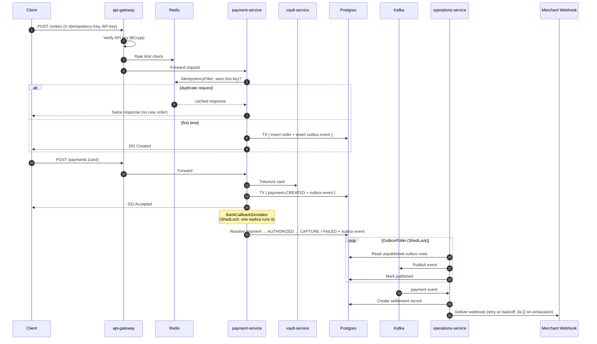
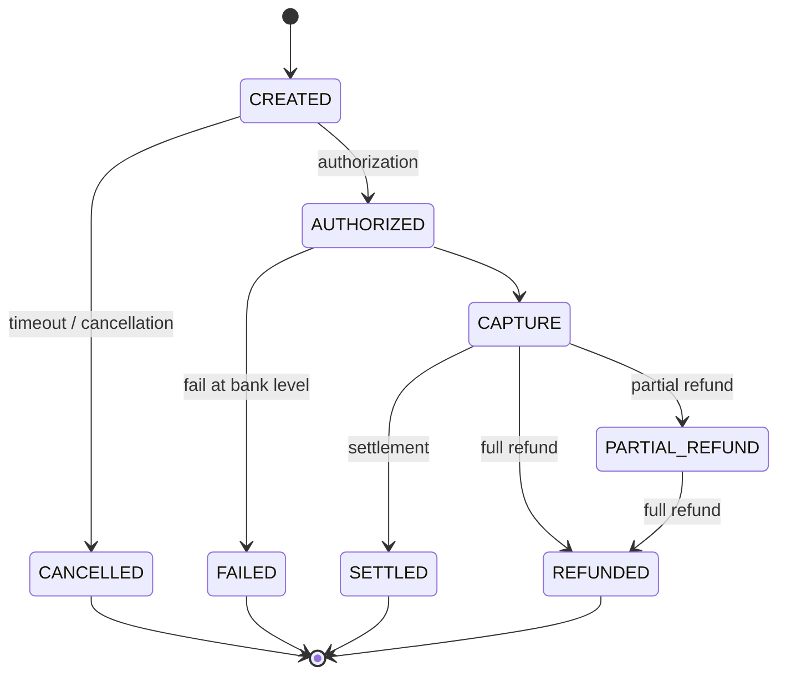
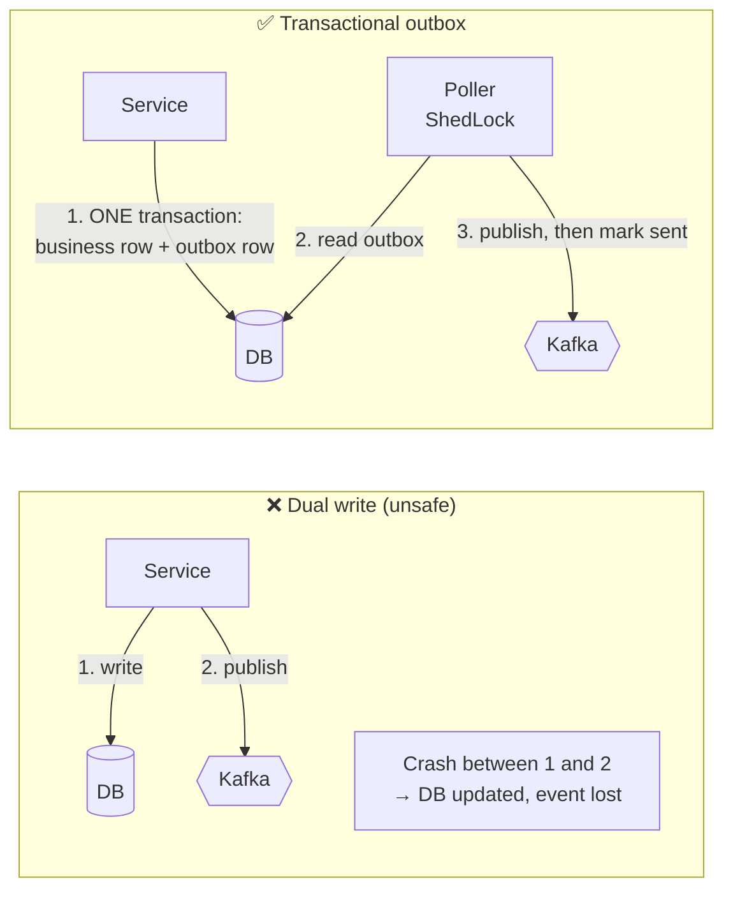

<div align="center">

# 💳 Razorpay Clone — Distributed Payment Platform

**A Kubernetes-native, event-driven payment gateway built with Spring Boot microservices.**
Order creation · Payment authorization · Bank callback simulation · Settlement · Webhooks


</div>

---

## 📑 Table of Contents

1. [Project Overview](#-project-overview)
2. [Project Architecture Overview](#-project-architecture-overview)
3. [Payment Methods Flow](#-payment-methods-flow)
4. [Data Model](#-data-model)
5. [Design Patterns Involved](#-design-patterns-involved)
6. [Optimisations and Bug Fixes](#-optimisations-and-bug-fixes)
7. [Load Testing with JMeter](#-load-testing-with-jmeter)
8. [Distributed Configuration (GitHub Config Repo)](#distributed-configuration)
9. [Deploying on Kubernetes](#deploying-on-kubernetes)

---

## 🚀 Project Overview

A distributed payment platform modelled on how **Stripe, Razorpay and Adyen** structure their systems in production. It covers the full lifecycle:

```
Order → Payment → Async Bank Resolution → Settlement → Webhook Delivery
```

Built with **Java 25** and **Spring Boot 4.1.1** across **7 microservices**, backed by **per-service Postgres databases, Redis, and Kafka**, with a full **observability stack**, and running as a real Kubernetes deployment (`Deployment`, `StatefulSet`, `Service`, `ConfigMap`, `Secret`).

### What actually got built

- ✅ **A correct, idempotent, distributed payment flow** using the consistency patterns production fintech systems depend on: transactional outbox, distributed locking, idempotency keys.
- ✅ **A real Kubernetes deployment**: 7 services + 3 stateful data stores as actual manifests, applied, restarted, scaled and debugged against a live cluster with the standard `kubectl` workflow.
- ✅ **A fully wired observability stack**: Prometheus scraping every service, a custom Grafana dashboard, Zipkin distributed tracing, used live to find and confirm every bottleneck documented here.

---

## 🏗 Project Architecture Overview

### Services

| Service | Responsibility |
|---|---|
| `api-gateway` | Auth (API key + BCrypt), rate limiting, routing |
| `payment-service` | Orders, payments, state machine, bank callback simulation |
| `merchant-service` | Merchant accounts, API keys, customers, webhooks |
| `operations-service` | Settlements, webhook delivery, outbox relay |
| `vault-service` | Card tokenization, encryption |
| `config-server` | Centralized config (Spring Cloud Config, git-backed, see [config repo](https://github.com/KamaliyaVishal/distributed-razorpay-clone-config)) |
| `discovery-service` | Service registry |

### High-level system design


Clients reach the platform through the **API Gateway**: the checkout SDK and analytics dashboard use JWT, while merchant backends use server-to-server **API key** auth. Business services (`merchant`, `payment`, `operations`, `vault`) sit behind the gateway in a private subnet, share Redis for cache and counters, exchange events over Kafka via the outbox, and each own their own database (`merchant-db`, `payment-db`, `operations-db`, `vault-db`).

### Payment lifecycle (sequence)



### Payment object lifecycle (state machine)



Every transition is recorded in `PAYMENT_TRANSITION_LOG` (from/to status, event type, actor, reason), so the full history of a payment can be audited.

---

## 💸 Payment Methods Flow

End-to-end sequence diagrams for the four supported payment methods: **Card**, **UPI**, **Net Banking** and **Wallet**.


| Method | How it works | Notable detail |
|---|---|---|
| **Card** | Card details go to `vault-service`, which encrypts the PAN and returns a token. The processor swaps the token for the real PAN to authorize via acquirer, card network and issuer. | Funds are held on authorization, then settled in a T+1 batch. Net = amount − transfer fee − scheme fee − PG fees. |
| **UPI** | Intent (mobile app-to-app) or Collect (VPA entered at checkout) via the NPCI UPI switch. | Near-instant settlement at the rail; the payment goes AUTHORIZED then CAPTURED. |
| **Net Banking** | Gateway builds a signed redirect URL, the customer authenticates on the issuing bank's site, and the bank sends a signed webhook back. | Gateway verifies the signature and status before moving to CAPTURED. |
| **Wallet** | Direct API call to the wallet provider with an OTP step. | Closed-loop: the wallet provider is its own issuer, so debit and commit are instant. Insufficient balance returns an error. |

In every flow, the merchant is notified by an **HMAC-signed `payment.captured` webhook**, and money moves to the merchant account asynchronously (T+1) through the settlement scheduler, ending in `SETTLED`.

---

## 🗄 Data Model

Each service owns its own database. The logical grouping of tables is:

| Database | Tables |
|---|---|
| `merchant-db` | `MERCHANT`, `API_KEY`, `APP_USER`, `MERCHANT_WEBHOOK_CONFIG`, `CUSTOMER` |
| `payment-db` | `ORDER_RECORD`, `PAYMENT`, `REFUND`, `PAYMENT_TRANSITION_LOG` |
| `vault-db` | `VAULT_CARD`, `CARD_TOKEN` |
| `operations-db` | `WEBHOOK_EVENT`, `DLQ_EVENT`, `SETTLEMENT`, `SETTLEMENT_PAYMENT` |

Design notes:

- **Money is stored as `long` in paise** (`amount_paise`), never as floating point.
- `idempotency_key` columns on `ORDER_RECORD` and `PAYMENT` back the idempotency guarantee at the database level.
- `VAULT_CARD` stores only the **encrypted PAN and encrypted DEK**, plus `last_four`, `brand`, `bin` and expiry; the raw PAN is never persisted.
- `WEBHOOK_EVENT` tracks attempts, `next_retry_at` and response codes, and exhausted events move to `DLQ_EVENT` for replay.
- `SETTLEMENT` breaks each payout into gross, refund, fee, GST and net amounts.

---

## 🧩 Design Patterns Involved

| Pattern | Where | What breaks without it, at scale |
|---|---|---|
| **Idempotency keys** | `X-Idempotency-Key` header, Redis-backed `IdempotencyFilter` | Retries are constant at scale (timeouts, LB failover, network blips). Without this, retries create duplicate orders/charges. |
| **Distributed scheduler locking** | **ShedLock** on `OutboxPoller`, `BankCallbackSimulator` | The moment you run >1 replica of any `@Scheduled` job, every replica double-processes the same work. |
| **Transactional outbox** | Outbox table + poller, atomic with the business write | "Write to DB" and "publish to Kafka" can't both be guaranteed under partial failure. A real distributed-systems bug, not an edge case. |
| **Stateless services** | Every service: DB/Redis hold all state, not memory | The precondition for horizontal scaling. If two consecutive requests need the same pod, you can't add replicas. |
| **Rate limiting** | Redis-backed, per API key (token bucket / sliding window / fixed window all implemented) | One misbehaving client takes everyone down. |
| **Circuit breaker + retry** | Resilience4j around the `merchant-service` Feign call | More scale = more failure surface. Stops one slow dependency cascading into a full outage. |
| **Full observability** | Prometheus + Grafana (per-service CPU/memory), Zipkin tracing | You can't capacity-plan or debug a system you can't see into. |

### Why the outbox pattern matters



Delivery is **at-least-once**, so consumers are idempotent as well.

---

## 🔧 Optimisations and Bug Fixes

Every item below was found using the observability stack (Grafana dashboards + Zipkin traces) and confirmed under load.

| # | Problem observed | Root cause | Fix |
|---|---|---|---|
| 1 | Duplicate orders/charges on client retry | No dedup on retried requests | Redis-backed `IdempotencyFilter` keyed on `X-Idempotency-Key`, with a DB-level `idempotency_key` column as a backstop |
| 2 | Same outbox rows / settlements processed twice after scaling to >1 replica | `@Scheduled` jobs ran on every pod | **ShedLock** on `OutboxPoller` and `BankCallbackSimulator` so only one replica executes at a time |
| 3 | Events lost when the Kafka publish failed after the DB commit | Dual write | Transactional outbox + poller: the business row and event are committed atomically |
| 4 | One slow dependency stalled request threads | Unbounded Feign calls to `merchant-service` | Resilience4j circuit breaker + retry + timeouts to contain failures and fail fast |

---

## 📈 Load Testing with JMeter

To ensure the microservice architecture can handle production-level traffic safely, comprehensive stress testing was executed using Apache JMeter. 


---

<a id="distributed-configuration"></a>
## 🔧 Distributed Configuration (GitHub Config Repo)

All service configuration is externalised and served by **Spring Cloud Config Server** (`config-server`), backed by a dedicated Git repository:

👉 **[distributed-razorpay-clone-config](https://github.com/KamaliyaVishal/distributed-razorpay-clone-config)**

Each microservice keeps only a minimal bootstrap config, pulls the rest from the config server at startup, and the config server reads it from GitHub.

```
GitHub config repo ──▶ config-server ──▶ api-gateway / merchant / payment / operations / vault
```

### Config repo layout

| File | Applies to |
|---|---|
| `application.yaml` | Shared defaults for **every** service |
| `api-gateway.yaml` | `api-gateway` only |
| `merchant-service.yaml` | `merchant-service` only |
| `payment-service.yaml` | `payment-service` only |
| `operations-service.yaml` | `operations-service` only |
| `vault-service.yaml` | `vault-service` only |

Service-specific files override the shared `application.yaml`.

### Why a Git-backed config repo?

- **Single source of truth**: configuration for all services lives in one place, not baked into images.
- **Change without rebuilding**: update a property, push to Git, and restart the service. No new Docker image needed.
- **Versioned and auditable**: every config change is a Git commit that can be reviewed and rolled back.
- **Environment-friendly**: the same images run on any cluster; only the config repo changes.

> Because every service fetches its config at startup, **`config-server` must be up and healthy before the other services** (see the deployment steps below).

---

<a id="deploying-on-kubernetes"></a>
## ☸️ Deploying on Kubernetes

The services run as standard Kubernetes manifests. For local development this project uses **[kind](https://kind.sigs.k8s.io/)** (Kubernetes IN Docker), which runs cluster nodes as Docker containers instead of heavy virtual machines, saving CPU and RAM.

### Step 1: Build and publish the Docker images

Build an image for each service and push it to your Docker Hub registry:

- `config-server`
- `api-gateway`
- `merchant-service`
- `operations-service`
- `payment-service`
- `vault-service`

```bash
# repeat for each service
docker build -t <your-dockerhub-username>/<service-name>:latest .
docker push <your-dockerhub-username>/<service-name>:latest
```

Make sure the image names in the Kubernetes manifests match your Docker Hub repositories.

### Step 2: Create the kind cluster

```bash
kind create cluster --config kind-config.yaml
```

### Step 3: Deploy with Kustomize (two phases)

The services fetch their configuration from `config-server` on startup, so they must be deployed **after** the config server is up and running. `kustomization.yaml` is therefore applied in two phases.

**Phase 1: infrastructure and config server only**

In `kustomization.yaml`, comment out the application services:

```yaml
resources:
  # ... data stores, config-server, etc. stay enabled ...
  # - services/api-gateway.yaml
  # - services/merchant-service.yaml
  # - services/payment-service.yaml
  # - services/operations-service.yaml
  # - services/vault-service.yaml
```

```bash
kubectl apply -k .
kubectl get pods -w     # wait until config-server is Running / Ready
```

**Phase 2: application services**

Once `config-server` is healthy, uncomment the five services and apply again:

```yaml
resources:
  - services/api-gateway.yaml
  - services/merchant-service.yaml
  - services/payment-service.yaml
  - services/operations-service.yaml
  - services/vault-service.yaml
```

```bash
kubectl apply -k .
kubectl get pods -w
```

### Scale and verify

```bash
kubectl -n payments scale deploy/payment-service --replicas=4
kubectl -n payments get pods -w
```

### Autoscaling

```bash
kubectl -n payments autoscale deploy api-gateway     --cpu-percent=60 --min=2 --max=10
kubectl -n payments autoscale deploy payment-service --cpu-percent=60 --min=2 --max=10
```

---

<div align="center">

**Built to learn how real payment systems stay correct at scale.** ⭐ Star the repo if it helped you!

</div>
